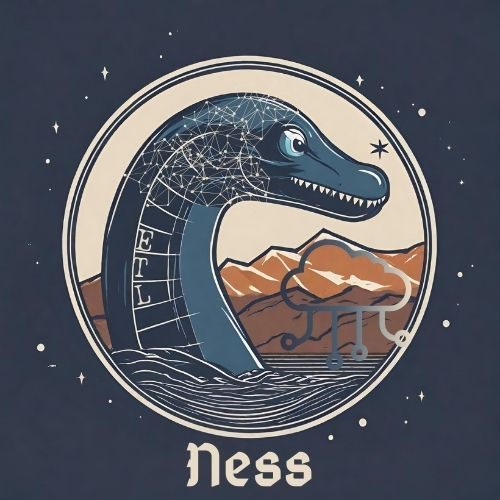

# Northcoder Data Engineering Group Project

## Contributors - Team Ness

 <a href="https://github.com/Sandpaul">Paul Sandford</a> | <a href="https://github.com/ldearlove">Liam Dearlove</a> | <a href="https://github.com/innateterina">Inna Teterina</a> | <a href="https://github.com/muhammad7877">Muhammad Raza</a> | <a href="https://github.com/Irfan6672">Muhammed Irfan</a> | <a href="https://github.com/KiraHeichou">Rahul Aneesh</a>
 

 

 

 ## Overview

 This project creates a data platform that extracts data from an operational OLTP (Online Transaction Processing) database, archives it in a data lake and makes it available in a remodelled OLAP (Online Analytical Processing) data warehouse. The platform is hosted on Amazon Web Services (AWS). 

 ([Click here](https://github.com/northcoders/de-project-specification) for full project specification.)

 - AWS Eventbridge triggers the `extract Lambda` function to extract data from the operational database periodically. AWS Systems Manager Paramater Store is used to store a `last_ingested_timestamp` so that only new entries are extracted. Extracted data is stored as JSON in an AWS s3 bucket.

 - When new data enters the ingestion bucket the `transform Lambda` is triggered. This will extract data from the passed JSON file, convert it to a dataframe, transform it as appropriate and save it in parquet format in another AWS s3 bucket.

 - When new data enters the processed data bucket the `load Lambda` is triggered. This will extract data from the passed parquet file and load it into the data warehouse as appropriate.

 - The extract, transform and load processes are all monitored using AWS CloudWatch.

 - AWS infrastructure is built using Terraform as IaC (Infrastructure as Code).

 - CI/CD (continuous integration/continuous deployment) is managed by GitHub Actions.